.. _tutorial:

Tutorial
========

This tutorial will walk you through the usage of pyRAST. It is recommended that you have a basic understanding of Python before proceeding.
This tutorial follows along with the 'Cu-BTC_CO2_N2' Jupyter notebook provided in the 'tests/case_studies' directory. We will be showing
the code snippets from the notebook and explaining them in more detail. Code for plotting will be shown when the built-in plotting functions are used.
If you would like to see the full code for plotting, please refer to the Jupyter notebook. Let's get started!

Isotherm Modeling
-----------------
We start by importing the necessary modules. pyRAST requires isotherm data to be in a pandas Dataframe. ::

    import pandas as pd
    from pyrast.isotherms import CubicIsotherm, ModelIsotherm
    from pyrast.utilities.plotting import plot_isotherm, plot_spreading_pressure

Then, we will import the data: ::

    # Load binary data
    co2_n2_binary = pd.read_csv('../test_data/Cu-BTC_CO2_N2_298K_isotherm.csv')

    # Load pure component data
    co2_pure = pd.read_csv('../test_data/Cu-BTC_CO2_298K_isotherm.csv')
    n2_pure = pd.read_csv('../test_data/Cu-BTC_N2_298K_isotherm.csv')

We will work with two isotherm types here: ModelIsotherm and CubicIsotherm. To fit an analytical isotherm, we use the ModelIsotherm class.
The class takes in a pandas Dataframe containing the isotherm data, labels for the uptake and pressure columns, and the name of the analytical isotherm to fit.
Positional or keyword arguments are accepted.
The models currently supported are: *Langmuir, DSLangmuir, Henry, BET, TemkinApprox, and Quadratic*. There are also vacancy solution theory isotherms,
which are created in the same way, but the loading, spreading pressure, and p^0 are stored as an interpolator. The available VST isotherms are: *W-VST, FH-VST, aNRTL-VST,
and sNRTL-VST*. 

We will fit the CO2 isotherm to demonstrate. Note that we are using fugacity, not pressure. ::

    # Fit isotherms with default settings
    co2_langmuir = ModelIsotherm(co2_pure, 'CO2_uptake_absolute[mol/kg]',
                                'CO2_fugacity[Pa]', 'Langmuir')
    co2_wvst = ModelIsotherm(df=co2_pure, loading_key='CO2_uptake_absolute[mol/kg]',
                          pressure_key='CO2_fugacity[Pa]', model='W-VST')

You can view the fitted parameters, initial guess, and RMSE by printing the isotherm object. ::

    print(co2_langmuir)
    # Langmuir Isotherm with parameters: {'M': np.float64(20.34386540229435), 'K': np.float64(1.4853854243904581e-06)},
    # guess: {'M': np.float64(25.347482600000003), 'K': np.float64(3.3928533709848526e-06)}, and RMSE: 0.8003503568618778

If you want to set the model parameters without fitting, you can pass in a dictionary to 'model_parameters'. The dataframe and loading/pressure keys are still required,
but you can pass in an empty dataframe and empty strings for the keys. ::

    params = {'M': 20.0, 'K': 1e-6}
    co2_langmuir = ModelIsotherm(co2_pure, 'CO2_uptake_absolute[mol/kg]',
                                'CO2_fugacity[Pa]', 'Langmuir', model_parameters=params)

pyRAST uses the scipy.optimize.least_squares function to fit isotherm models. The default settings for fitting include bounds on parameters and
a default guess based on the Langmuir isotherm. You can specify your own initial guess or bounds by passing in dictionaries for the 'param_guess'
and 'param_bounds' keyword arguments. You can also pass in a dictionary of other keyword arguments to the least_squares function using
the 'optimization_options' keyword argument. For more information on available options, please refer to the scipy.optimize.least_squares documentation.

You can also fit an interpolator isotherm, which will "perfectly" fit the data by interpolating between the data points. The suggested interpolator isotherm is
the CubicIsotherm, which uses monotonic cubic splines to interpolate the data. In our testing, we find that *cubic interpolation performs better than linear
interpolation*, which is implemented in the InterpolatorIsotherm class. The CubicIsotherm is created in the same way as the ModelIsotherm without specifying
a model name. ::

    co2_cubic = CubicIsotherm(co2_pure, 'CO2_uptake_absolute[mol/kg]', 'CO2_fugacity[Pa]')

We can visualize the fits and spreading pressure integrals using the built-in plotting functions. These functions take in a single isotherm object or list of isotherm objects.
We also use the parameter 'xlogscale' to set the x-axis to a logarithmic scale. ::

    # Visualize the fits
    plot_isotherm([co2_langmuir, co2_wvst, co2_cubic], xlogscale=True)
    # Compare spreading pressures
    plot_spreading_pressure([co2_langmuir, co2_wvst, co2_cubic], xlogscale=True)

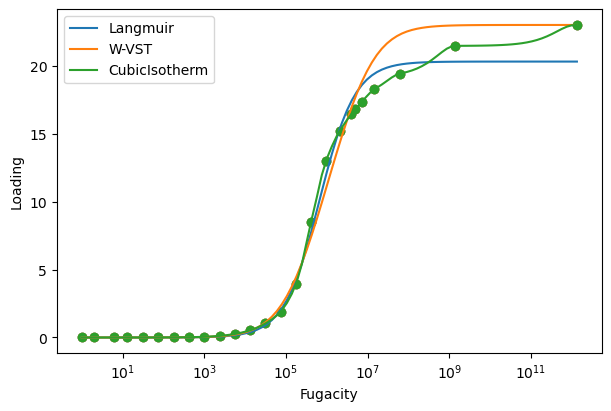

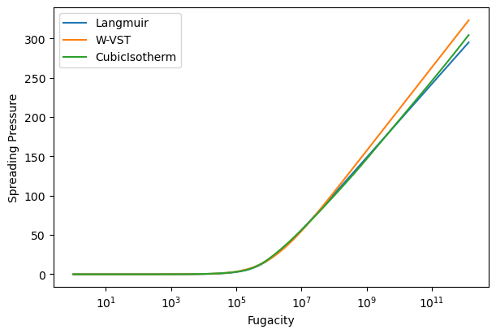

We are currently only showing fits in the range of the data, but IAST and RAST calculations often require extrapolation to higher pressures.
The CubicIsotherm by default does not extrapolate data. To extrapolate, we can pass an extrapolation method, *either 'linear' or an analytical isotherm model name*.
The linear method fits a line to the last two points in the isotherm and uses it to extrapolate. The analytical isotherm method fits the specified model
to the entire data range and uses it to extrapolate. To compare methods, we will showcase a linear extrapolation and a Langmuir extrapolation. ::

    linear_extrap = CubicIsotherm(co2_pure, 'CO2_uptake_absolute[mol/kg]',
                              'CO2_fugacity[Pa]', extrap_method='linear')
    model_extrap = CubicIsotherm(co2_pure, 'CO2_uptake_absolute[mol/kg]',
                                'CO2_fugacity[Pa]', extrap_method='Langmuir')
    pressures = np.logspace(1, 14, 100)
    # We can set the pressure range for plotting using the 'pressures' keyword argument.
    plot_isotherm([linear_extrap, model_extrap], xlogscale=True, pressures=pressures)

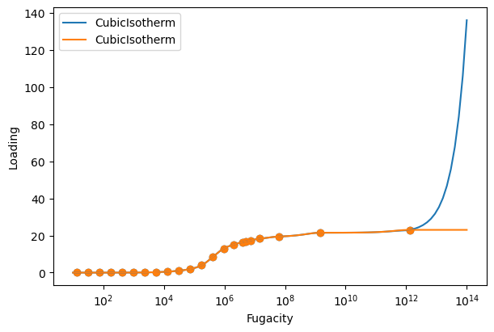

Notice that the linear extrapolation explodes at high pressures, while the Langmuir extrapolation maintains the saturation loading. **Analytical model
extrapolation is therefore recommended.** To better demonstrate how analytical extrapolation works, we will build a CubicIsotherm using fugacity
data up to 10 bar. ::

    co2_cubic = CubicIsotherm(co2_pure, 'CO2_uptake_absolute[mol/kg]', 'CO2_fugacity[Pa]')
    shortened_data = co2_pure[co2_pure['CO2_fugacity[Pa]'] <= 1e6]
    shortened_extrap = CubicIsotherm(shortened_data, 'CO2_uptake_absolute[mol/kg]',
                                    'CO2_fugacity[Pa]', extrap_method='Langmuir')
    shortened_langmuir = ModelIsotherm(shortened_data, 'CO2_uptake_absolute[mol/kg]',
                                    'CO2_fugacity[Pa]', 'Langmuir')
    pressures = np.logspace(1, 10, 100)
    plot_isotherm([co2_cubic, shortened_langmuir, shortened_extrap], xlogscale=True,
                pressures=pressures)

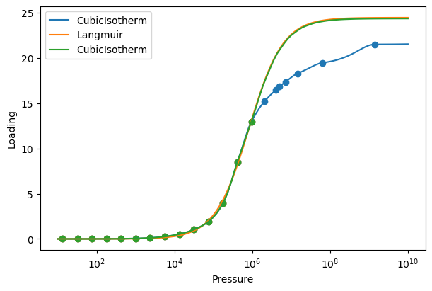

The original data is shown in blue, the extrapolated isotherm in green, and a Langmuir isotherm fit to the shortened data in orange.
Notice how the extrapolated isotherm does not exactly overlap with the Langmuir fit (there is a very small difference). When building an extrapolated isotherm, the
*analytical model is shifted vertically so that it intersects the last point in the data*. This is done to ensure a continuous isotherm.
Also, the extrapolated isotherm does not match the original data at high fugacities. The goal of extrapolation is to *provide a reasonable,
physically motivated estimate of the isotherm at high fugacities*. The higher the fugacity range of the data, the more accurate the extrapolation will be.

For the rest of the tutorial, we will use CubicIsotherm models with Langmuir extrapolation for both CO2 and N2. The isotherms are built and
plotted in the same way as before. ::

    co2_isotherm = CubicIsotherm(co2_pure, 'CO2_uptake_absolute[mol/kg]',
                             'CO2_fugacity[Pa]', extrap_method='Langmuir')
    n2_isotherm = CubicIsotherm(n2_pure, 'N2_uptake_absolute[mol/kg]',
                                'N2_fugacity[Pa]', extrap_method='Langmuir')
    plot_isotherm([co2_isotherm, n2_isotherm], xlogscale=True)

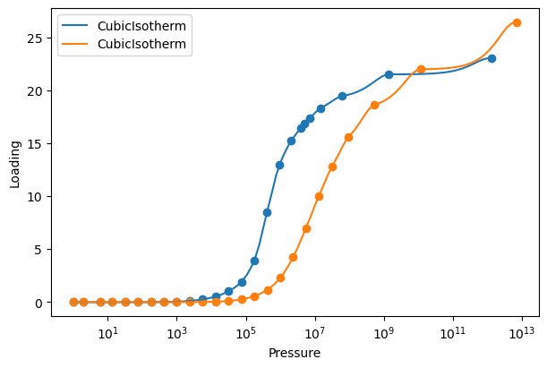

Ideal Adsorbed Solution Theory (IAST) Calculations
--------------------------------------------------
We start by importing the 'iast' module. ::

    from pyrast.calculations.iast import iast

IAST calculations require the partial fugacities (or pressures) of the components in the mixture and a list of the isotherm objects for each component.
The function will return the loading of each component in the mixture. IAST calculations can be performed with any number of components. For our system,
we will perform an IAST calculation for a 50/50 mixture of CO2 and N2 at 1e6 Pa total fugacity. ::

    partial_fugacities = [5e5, 5e5]
    isotherms = [co2_isotherm, n2_isotherm]
    loadings = iast(partial_fugacities, isotherms)
    print(f"Predicted loadings: {loadings} mol/kg")
    # Predicted loadings: [9.13550843 0.66089733] mol/kg

The predicted loadings are 9.13 mol/kg for CO2 and 0.66 mol/kg for N2. The units of the loadings are the same as the units of the isotherm data. For
more information about the calculations, we can use the 'verbose' keyword argument. ::

    loadings = iast(partial_fugacities, isotherms, verbose=True)
    #Performing IAST calculation for 2 components.
    #Component 0: Partial Pressure = 500000.0, Isotherm Model = CubicIsotherm
    #Component 1: Partial Pressure = 500000.0, Isotherm Model = CubicIsotherm
    #Component  0
    #    p =  500000.0
    #    p^0 =  536171.8966459377
    #    Loading:  9.135508426540186
    #    x =  0.9325367538429119
    #    Spreading pressure =  12.545999054819386
    #Component  1
    #    p =  500000.0
    #    p^0 =  7411442.948294405
    #    Loading:  0.6608973332258088
    #    x =  0.06746324615708807
    #    Spreading pressure =  12.545999054819385

The verbose keyword shows why extrapolation can often be required. With a much higher loading of CO2, the N2 isotherm needs to be evaluated at
a fugacity an order of magnitude larger than the CO2 isotherm.

We can use the iast function many times across fugacities and compositions to generate a surface of loadings.

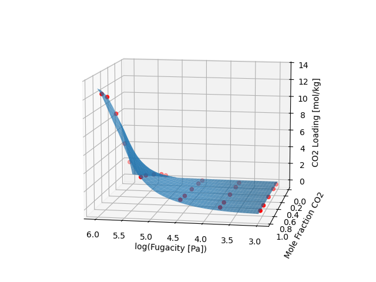

IAST overall captures the trend of loading, but we can look at selectivity for a more sensitive metric.
For a 50/50 mixture, the selectivity across many fugacities can be plotted. 

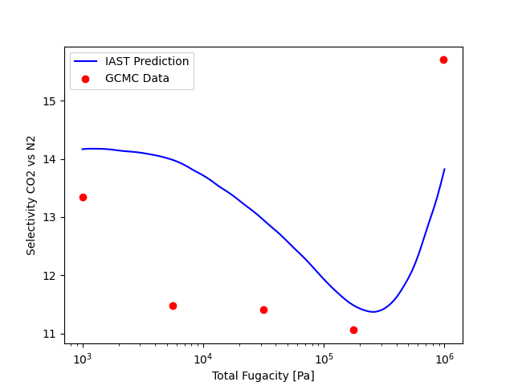

Although IAST is pretty good at predicting this mixture, let's see if we can improve the predictions using RAST.

Activity Coefficient Fitting
----------------------------
pyRAST aims to make activity coefficient fitting as simple as possible. The ActivityCoefficient class requires
binary adsorption data, pure component isotherms, and the name of the model to fit. The binary adsorption data
is input similar to IAST or RAST calculations. Partial fugacities are input as a (n,2) array with each row corresponding
to a data point and each column corresponding to a component. The same is true for the loadings. In pyRAST, it
is also possible to fit a model to total loadings. In that case, the loading array is a 1D array of total loadings,
and the partial fugacity input is the same as before. Pure component isotherms must always be specified as a 1D list.
The model name is passed as a string. The available models are: *aNRTL, sNRTL,
sMargules, aMargules, Wilson, and VanLaar*. 

Activity coefficient models require at least 2 data points to fit all parameters in the models when using component
loadings. You can fit to a single data point, but the C parameter will be fixed. You can set the C parameter as a keyword
argument when creating the ActivityCoefficient object. When fitting to total loadings, you need at least 1 data point
per model parameter.

There are many optional parameters that are fully described in the documentation. The most important parameters are 
'total_loading', which must be set to True if fitting to total loadings, and 'model_parameters', which can be used 
to set the model parameters directly, bypassing the fitting process. The 'verbose' parameter can be set to True to 
print information about the fitting process.

We start by importing the ActivityCoefficient class. ::

    from pyrast.activity_coefficients import ActivityCoefficient

For simplicity, we will use all of the binary data in the dataset to fit the activity coefficient model. ::

    partial_fug = np.array([co2_n2_binary['CO2_fugacity[Pa]'].values,
                        co2_n2_binary['N2_fugacity[Pa]'].values])
    partial_fug = partial_fug.T
    loadings = np.array([co2_n2_binary['CO2_uptake_absolute[mol/kg]'].values,
                co2_n2_binary['N2_uptake_absolute[mol/kg]'].values])
    loadings = loadings.T
    isotherms = [co2_isotherm, n2_isotherm]
    ac = ActivityCoefficient(partial_fug, loadings, isotherms, 'aNRTL')

Like the isotherm objects, we can print information about the activity coefficient model. ::    
    
    print(ac)
    # aNRTL activity coefficient model with parameters: {'t12': np.float64(-6.872376399172517e-05), 'C': np.float64(3.58319561026762)}

Fitting activity coefficient models is as simple as that! There are important considerations for fitting that are discussed in the manuscript.
Remember that fitting can be sensitive to the initial guess and data. Comparing C parameters across different models is not recommended.
And currently, **pyRAST only supports binary systems**.

Real Adsorbed Solution Theory (RAST) Calculations
-------------------------------------------------
We start by importing the 'rast' module. ::

    from pyrast.calculations.rast import rast

RAST calculations require the *same inputs as IAST calculations with the addition of an activity coefficient model*. We will first show
a sample RAST calculation, then create x-y diagrams and selectivity plots for aNRTL and VanLaar models. ::

    partial_fugacities = [5e5, 5e5]
    isotherms = [co2_isotherm, n2_isotherm]
    loadings = rast(partial_fugacities, isotherms, ac)
    print(f"Predicted loadings: {loadings} mol/kg")
    #Predicted loadings: [9.13550843 0.66089733] mol/kg

The predicted loadings are 9.14 mol/kg for CO2 and 0.66 mol/kg for N2. The units of the loadings are the same as the units of the isotherm data. For
more information about the calculations, we can use the 'verbose' keyword argument. ::

    loadings = rast(partial_fugacities, isotherms, ac, verbose=True)
    #Performing RAST calculation for 2 components.
    #Component 0: Partial Fugacity = 500000.0, Isotherm Model = CubicIsotherm
    #Component 1: Partial Fugacity = 500000.0, Isotherm Model = CubicIsotherm
    #Component  0
    #    p =  500000.0
    #    p^0 =  536171.8966928974
    #    Loading:  9.135508426096102
    #    x =  0.9325367537672508
    #    Spreading pressure =  12.545999055705282
    #Component  1
    #        p =  500000.0
    #        p^0 =  7411442.94911436
    #        Loading:  0.6608973339885112
    #        x =  0.06746324623274924
    #        Spreading pressure =  12.545999055705282

Now, we will create an x-y diagram at 1e6 Pa total fugacity and a selectivity plot across many total fugacities for the aNRTL model.
As stated before, the full plotting code is in the Jupyter notebook.

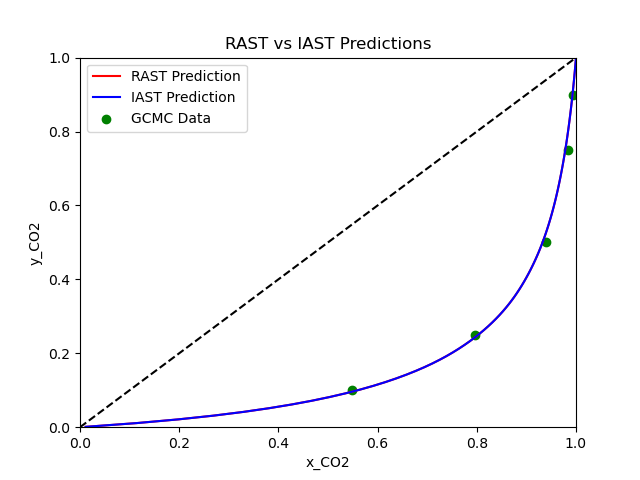

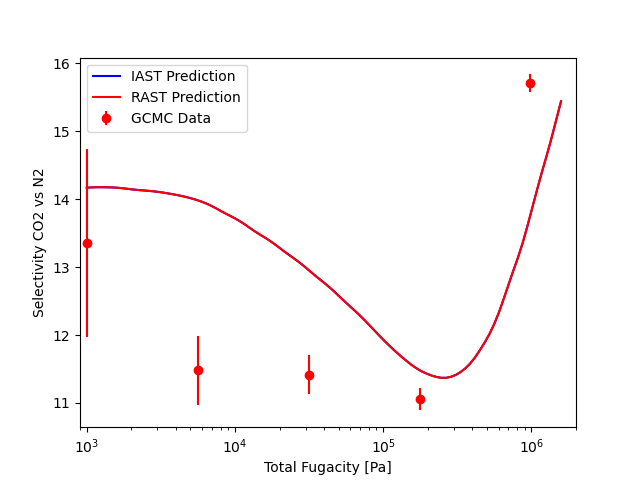

Notice how there is very little difference between IAST and RAST on the x-y diagram and selectivity plot. Let's repeat this using the
Van Laar model and see how it compares to the aNRTL model.

When we try fitting to the Van Laar model, we encounter an exception that the adsorbed phase mole fraction solving failed.
**By default, pyRAST uses a global fit method that performs a RAST calculation for each data point using the current model parameters.**
This calculation can sometimes fail if the least squares fitting tries to evaluate the model with parameters that are not reasonable.
To avoid this, we can use a *local fit method* that might work better here. The local fit method uses a residual based on activity coefficients
instead of loadings. Generally, the global fit is recommended, but the local fit can be used as a backup. Alternatively, the *local fit can be used
to determine model parameters, which can then be used as a "warm" initial guess for a global fit*. Let's see how the local fit performs.

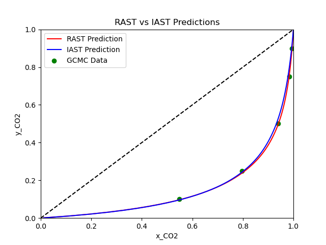

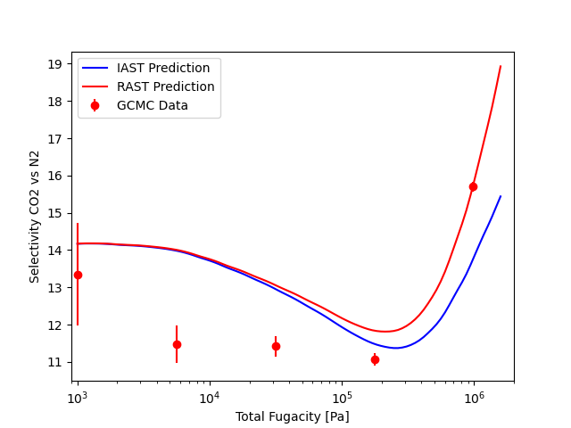

With the Van Laar model, we can see that the RAST predictions are better on the x-y diagram, and the selectivity of RAST is
more accurate at higher fugacities. At lower fugacities, the Van Laar model converges to the IAST predictions. Overall, we
see a relatively small difference between IAST and RAST using the CubicIsotherm. This is because the CubicIsotherm fits the
pure component data very well, which limits the improvement that can be achieved by fitting an activity coefficient model.

However, if we were to *use a less accurate isotherm fit*, such as the Langmuir, *we would see a much larger difference between
IAST and RAST predictions*. Let's see how this looks using the Langmuir isotherm and aNRTL model instead of the CubicIsotherm.

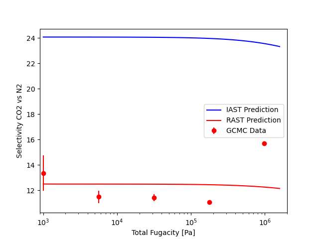

Here, we see a much larger difference between IAST and RAST predictions. The x-y diagram shows slight improvement at lower mole
fractions of CO2, but the selectivity plot shows a significant improvement across the entire range of fugacities. With a poor fit
of the pure component data, IAST predictions can be significantly off, but RAST can help correct for this and produce more accurate
predictions of mixture adsorption. This highlights the *importance of fitting accurate isotherms to pure component data*, and also the
value of using activity coefficient models and RAST when analyzing mixture adsorption data.

We have now seen how to use pyRAST to fit isotherms, perform IAST calculations, fit activity coefficient models, and perform RAST calculations.
The case study we went through is just one example of how pyRAST can be used to analyze adsorption data. The flexibility of the package allows
for many models and applications. **We encourage you to explore the documentation and try out pyRAST on your own datasets!**

Additional Features
-------------------

We will quickly demonstrate two more components of pyRAST: fitting to total loading and reverse IAST/RAST calculations.

Let's look at total loading fitting first. We will use the same binary data as before and Langmuir isotherm fits for pure
component data. We calculate total loading for each data point by summing the component loadings. The total loading is then
used to fit the activity coefficient model with the keyword argument 'total_loading' set to True. ::

    partial_fug = np.array([co2_n2_binary['CO2_fugacity[Pa]'].values,
                        co2_n2_binary['N2_fugacity[Pa]'].values])
    partial_fug = partial_fug.T
    loadings = np.array([co2_n2_binary['CO2_uptake_absolute[mol/kg]'].values,
                co2_n2_binary['N2_uptake_absolute[mol/kg]'].values])
    loadings = loadings.T
    loadings = np.sum(loadings, axis=1)
    isotherms = [co2_isotherm, n2_isotherm]
    ac = ActivityCoefficient(partial_fug, loadings, isotherms, 'aNRTL', total_loading=True)
    print(ac)
    #aNRTL activity coefficient model with parameters: {'t12': np.float64(2.6619919051194842), 'C': np.float64(190.95715618679833)}

We can perform the same visualizations as before.

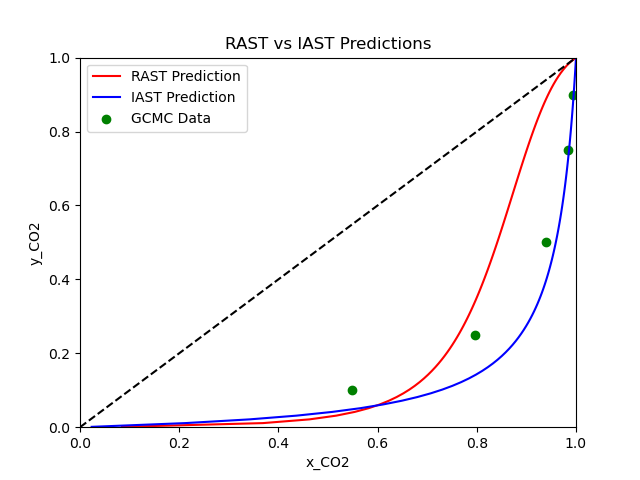

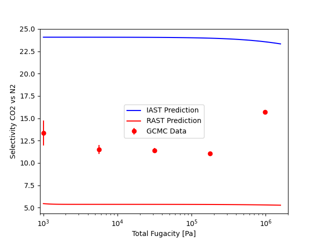

As you can see, fitting to total loading can be done just as easily as fitting to component loadings. Be careful though! The model
parameters are very different compared to fitting to component loadings. While the x-y diagram is similar, the selectivity plot
shows that the model fit to total loading is not as accurate in the pressure range we are looking at.

For our last demonstration, let's do a quick sanity check. Let's use a forward RAST calculation to predict the loadings of a mixture,
and then use reverse RAST to see if we can recover the original mixture composition. This is a good way to check that the RAST calculations
are working correctly. The reverse RAST calculation is performed using the 'reverse_rast' function, which takes in the adsorbed mole fractions,
total fugacity, pure component isotherms, and a fitted activity coefficient model. The function will return the predicted gas phase mole fractions. ::

    from pyrast.calculations.rast import reverse_rast
    # Forward calculation
    partial_fugacities = [5e5, 5e5]
    isotherms = [co2_isotherm, n2_isotherm]
    loadings = rast(partial_fugacities, isotherms, ac)

    # Reverse calculation
    adsorbed_fractions = loadings / np.sum(loadings)
    total_fugacity = 1e6
    print(f'Gas phase mole fractions: {reverse_rast(adsorbed_fractions, total_fugacity,
                                                    isotherms, ac)[0]}')
    # Gas phase mole fractions: [0.5 0.5]

This concludes the pyRAST tutorial. If you have further questions, please refer to the documentation, manuscript, or reach out to the authors.
We hope that you find pyRAST to be useful! If you use pyRAST in your research, please cite the manuscript. The citation is available in the README and documentation.
